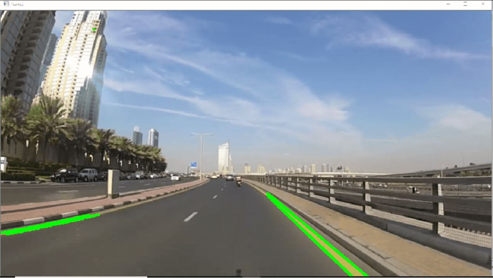

<div align="center">

# 🛣️ Lane Detection System

### Real-time Lane Detection using Computer Vision

[](https://www.python.org/downloads/)
[](https://opencv.org/)
[](LICENSE)

[Features](#-features) • [Demo](#-demo) • [Installation](#-installation) • [Usage](#-usage) • [How It Works](#-how-it-works) • [Contributing](#-contributing)

---

</div>

## 📋 Overview

A robust **lane detection system** that identifies and tracks road lane markings in real-time using computer vision techniques. This project processes video streams from dashcam footage and overlays detected lane boundaries, providing a visual guide for autonomous vehicle systems or driver assistance applications.

<div align="center">



</div>

---

## ✨ Features

- 🎥 **Real-time Processing** - Processes video streams with minimal latency
- 🎯 **Accurate Detection** - Uses advanced edge detection and Hough transforms
- 🖼️ **Region of Interest (ROI)** - Focuses on relevant road areas for improved performance
- 📊 **Lane Overlay** - Visual representation of detected lanes on original footage
- ⚡ **Efficient Algorithm** - Optimized for performance on standard hardware
- 🔧 **Configurable Parameters** - Easy tuning for different road conditions

---

## 🎬 Demo

The system processes dashcam footage and outputs video with detected lane markings highlighted in real-time.

**Input**: Road view from vehicle camera (`road_car_view.mp4`)  
**Output**: Processed video with lane overlay (`out.gif`)

---

## 🚀 Installation

### Prerequisites

- Python 3.7 or higher
- pip package manager

### Setup

1. **Clone the repository**
   ```bash
   git clone https://github.com/Devatva24/Lane-Detection.git
   cd Lane-Detection
   ```

2. **Install required dependencies**
   ```bash
   pip install opencv-python numpy matplotlib
   ```

---

## 💻 Usage

### Running the Lane Detection

```bash
python lane_detection_codespace.py
```

The script will:
1. Load the input video file (`road_car_view.mp4`)
2. Process each frame to detect lane markings
3. Save the output with detected lanes

### Customization

You can modify parameters in the script to adjust:
- **Canny edge detection thresholds**
- **Hough transform parameters**
- **Region of interest coordinates**
- **Line drawing style and color**

---

## 🔬 How It Works

The lane detection pipeline consists of several key steps:

### 1. **Preprocessing**
   - Convert frames to grayscale
   - Apply Gaussian blur to reduce noise
   
### 2. **Edge Detection**
   - Use Canny edge detection to identify lane boundaries
   - Highlight areas with significant intensity changes

### 3. **Region of Interest**
   - Define a polygonal mask to focus on the road area
   - Filter out irrelevant portions of the image

### 4. **Line Detection**
   - Apply Hough transform to detect straight lines
   - Identify lane markings from detected edges

### 5. **Lane Extrapolation**
   - Average and extrapolate detected line segments
   - Create smooth, continuous lane boundaries

### 6. **Overlay & Output**
   - Draw detected lanes on the original frame
   - Combine with input video for final output

---

## 📁 Project Structure

```
Lane-Detection/
├── lane_detection_codespace.py    # Main detection script
├── road_car_view.mp4               # Sample input video
├── out.gif                         # Output demonstration
├── README.md                       # Project documentation
├── .gitignore                      # Git ignore rules
└── .gitattributes                  # Git attributes
```

---

## 🛠️ Technologies Used

- **Python** - Core programming language
- **OpenCV** - Computer vision library for image processing
- **NumPy** - Numerical computing for array operations
- **Matplotlib** - Visualization and debugging (optional)

---

## 📈 Future Enhancements

- [ ] Curved lane detection using polynomial fitting
- [ ] Multi-lane detection support
- [ ] Night-time and adverse weather conditions
- [ ] Real-time webcam input support
- [ ] Integration with deep learning models (YOLO, U-Net)
- [ ] Lane departure warning system
- [ ] Performance optimization using GPU acceleration

---

## 🤝 Contributing

Contributions are welcome! Here's how you can help:

1. Fork the repository
2. Create a feature branch (`git checkout -b feature/AmazingFeature`)
3. Commit your changes (`git commit -m 'Add some AmazingFeature'`)
4. Push to the branch (`git push origin feature/AmazingFeature`)
5. Open a Pull Request

---

## 📝 License

This project is licensed under the MIT License - see the [LICENSE](LICENSE) file for details.

---

## 👤 Author

**Devatva24**

- GitHub: [@Devatva24](https://github.com/Devatva24)

---

## 🙏 Acknowledgments

- Inspired by autonomous vehicle research and ADAS systems
- Built using open-source computer vision libraries
- Special thanks to the OpenCV community

---

<div align="center">

### ⭐ If you find this project useful, please consider giving it a star!

**Made with ❤️ and Python**

</div>
